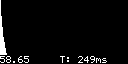

# simple_fuel_computer
Simple fuel consumption computer for various microcontrollers (ESP32, ESP8266).

## Features
- Real-time fuel consumption calculation based on injector pulse width.
- Rolling graph visualization of fuel usage.
- Data smoothing using Exponential Moving Average (EMA).
- RPM monitoring (in supported sketches).
- Mock Arduino testing environment for verification without hardware.

## Sketches
- `fuel_computer_esp8266_oled_rollin.ino`: Optimized for ESP8266 with SSD1306 OLED.
- `esp32_Bluedisplay_rolling.ino`: Targeted at ESP32 with BlueDisplay.
- `rolling_1sec.ino`: High-detail sketch with both RPM and Fuel graphs.
- `esp8266_oled.ino`: Simple fuel graph for ESP8266.
- `rolling_1sec_inj_only.ino`: Minimalist fuel graph with text overlay.

## Simulated Previews
Below are captures from the mock Arduino environment during various simulation phases:

### ESP8266 Fuel Computer (`fuel_computer_esp8266_oled_rollin.ino`)
| Idling | Accelerating | Cruising |
| :---: | :---: | :---: |
|  |  |  |

### ESP32 BlueDisplay (`esp32_Bluedisplay_rolling.ino`)
| Idling | Accelerating | Cruising |
| :---: | :---: | :---: |
|  |  |  |

### Combined RPM/Fuel Computer (`rolling_1sec.ino`)
| Idling | Accelerating | Cruising |
| :---: | :---: | :---: |
|  |  |  |

## Development and Testing
The project includes a mock Arduino environment for testing calculations and UI without physical hardware.

- **Mocks:** Located in `tests/mock/`.
- **Test Runner:** Modular simulation engine in `tests/mock/test_runner.cpp`.
- **Automation:** Use `python3 scripts/test_ino.py <file.ino>` to run simulations and generate previews.

See [tests/README.md](tests/README.md) for more details.
